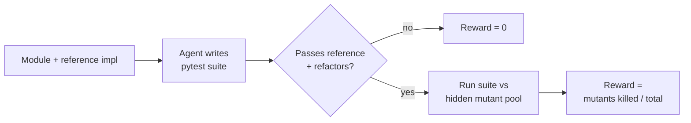
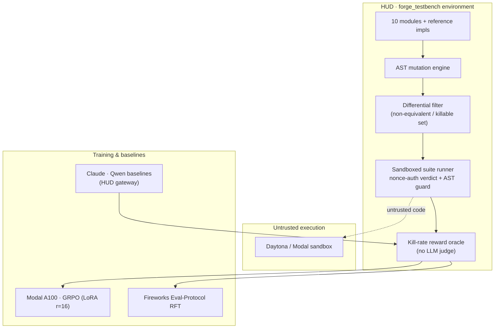

# TestBench-Forge

<p align="center">
  <strong>Train the test that catches the bug a human reviewer misses.</strong>
</p>

<p align="center">
  An RL gym that trains agents to write the pytest suite that kills the most hidden, freshly-injected bugs (mutants) — rewarded by a pure execution oracle we <strong>proved you can't game</strong>, and whose verification skill <strong>generalizes to modules it never saw</strong>.
</p>

<p align="center">
  HUD × YC — Frontier RL Environments Hackathon · Track: <strong>Agentic Collaboration</strong> · wedge: Chip Design
</p>

<p align="center">
  
  
  
  
  
  
  
  
</p>

> **The thesis.** Recursive self-improvement is bottlenecked on *trustworthy verification*. As agents do more autonomous work, the binding constraint isn't generation — it's a grader you can trust. An LLM-judge reward is itself gameable, so the only durable RL signal is an **execution oracle**. We built one for test-writing, **hardened it by attacking it ourselves**, and showed the verification skill it trains **generalizes to tasks it never saw**.

## Headline result

| Metric | Result |
| --- | --- |
| Held-out kill-rate — 3 modules **never trained on**, reproducible at n=16 | **0.23 → 0.79** |
| `binary_search` (held-out) | **0.31 → 0.93** |
| Train modules (7), in-training n=5 | **0.11 → 0.91** |
| Adversarial cheat attacks defeated (we broke our own reward, then fixed it) | **12 / 12 → score 0** |
| Zero-setup signal, no API key — lazy suite vs thorough suite | **0.62 vs 1.00** |

> We trained a model to write the test that catches the bug a human reviewer misses — scored only by bugs it has **never seen**.

## The loop

1. The agent sees a **module + its reference implementation**.
2. It writes a **pytest-style test suite** (`test_*` functions).
3. The harness runs the suite against a **hidden pool of mutants** (buggy variants of the reference).
4. **Reward = #mutants killed / #mutants**, gated by the suite first passing the reference **and** behavior-equivalent refactors (the over-specification gate). **No LLM judge — a pure execution oracle.**



## Why it's a strong RL environment (not an eval)

- **Multi-signal, verifiable reward** with a clean execution oracle — no LLM judge anywhere.
- **Non-gameable, and we proved it** — you cannot fake killing a bug you've never seen, and you cannot read the hidden bug out of the harness (we tried, and closed the hole).
- **Infinite data** — AST mutation operators × unlimited modules, differentially filtered to a clean killable 1.0 ceiling.
- **Generalizes** — a transferable verification skill, not module-specific memorization.

## Architecture

| Layer | Stack | Role |
| --- | --- | --- |
| Environment | HUD `forge_testbench` template + `run_tests` MCP tool | Serves a module + reference impl; exposes a gate-only dry-run for the agent |
| Mutation engine | Python AST operators (`testbench.py`) | Auto-generates buggy variants; a differential filter keeps only **non-equivalent (killable)** mutants |
| Reward oracle | Subprocess suite runner · nonce-authenticated verdict · AST import guard | Runs the agent's suite vs the hidden mutant pool; reward = kills / total — **no LLM judge** |
| Untrusted execution | Daytona / Modal sandbox (`REWARDFORGE_RUNNER`) | Isolates the agent's test code *and* the mutants as untrusted code |
| Training | Modal A100 · GRPO/LoRA (`modal_grpo.py`) · Fireworks Eval-Protocol RFT (`reward.py`) | Trains an open model on the dense kill-rate reward |
| Baselines | Claude + Qwen via HUD gateway | Frontier before/after comparison |



## What it proves

| Question | TestBench-Forge answer |
| --- | --- |
| Can a judge verify the reward in seconds? | **Yes** — `python3 selftest.py` runs on system Python, no venv / key / GPU: lazy **0.62**, thorough **1.00**, `assert False` **0.00**. |
| Is the reward gameable? | **No** — we broke it ourselves (a frame-walk exploit faked a perfect 1.0), then fixed it; **12/12** attacks now score 0 while legitimate suites stay 1.0 (`security_checks.py`). |
| Does the trained skill generalize? | **Yes** — held-out mean **0.23 → 0.79** on 3 modules never trained on. You don't label outputs; you train the **grader**, and the grading transfers — the RSI thesis made concrete. |
| Is it an environment, not an eval? | **Yes** — dense verifiable reward, infinite AST-generated data, and an on-policy GRPO run already executed end-to-end on a single A100. |

## Sponsor integrations

| Sponsor | Integrated as | Role & honest status |
| --- | --- | --- |
| **Modal** | Serverless A100 + parallel sandbox | Where the GRPO run **actually trained**; the LoRA adapter lives on a Modal volume. ✅ core, real |
| **HUD** | `forge_testbench` env template + gateway | The environment itself; frontier baselines via the gateway (Qwen3-8B **0.90**, Claude **0.60**). ✅ env + baselines |
| **Fireworks** | Eval-Protocol RFT handoff | `reward.py` + `testbench_eval_protocol.py` wired; best-of-1 inference baseline **0.487** (incl. gate failures). 🟡 wired; RFT launch blocked on billing |
| **Daytona** | Untrusted-code sandbox | `daytona_runner.py` (`REWARDFORGE_RUNNER=daytona`) isolates suites + mutants. ⚪ present |
| **Anthropic** | Claude frontier baseline | Claude as the before/after reference model. 🔵 baseline |

> Training landed on **Modal** because HUD's training backend hit capacity limits and Fireworks RFT was billing-blocked — so the verified result is Modal-led. We present what's real.

## Run it

**The interactive demo UI** (our frontend, Vite + React + framer-motion) launches with one command from the repo root:

```bash
./run.sh                     # installs deps on first run, then serves the demo at http://localhost:5173
```

Walk the hero + three beats (honest oracle · we broke our own reward · it generalizes) with `→` / `space`; source lives in `web/`.

A judge can also verify the whole signal directly with **system `python3` — no venv, no pip install, no API key, no GPU:**

```bash
git clone https://github.com/jenilkathrotia/YC---RL-Gym && cd YC---RL-Gym
python3 selftest.py          # the signal:    lazy 0.621 · thorough 1.000 · assert-False 0.000
python3 security_checks.py   # the cheat-proof: 12 adversarial attacks all 0.000 · legit suite 1.000
python3 stage_a_checks.py    # 5 more regression tests
```

Event-day (needs deps / keys / GPU):

```bash
modal run modal_grpo.py      # train Qwen2.5-3B with GRPO on a single A100 (LoRA r=16)
modal run dump_suites.py     # reload the saved adapter, re-measure held-out at n=16
hud eval tasks.py claude     # baseline a frontier model through the HUD gateway
```

## Validated numbers

```
module             mutants  weak    thorough
roman_to_int         18     0.222    1.000
binary_search        18     0.444    1.000
is_balanced           4     0.500    1.000   <- hero demo module
flatten               1     0.000    1.000
two_sum               4     0.750    1.000
is_palindrome         4     0.750    1.000
merge_intervals      18     0.778    1.000
fizzbuzz             18     0.833    1.000
run_length_encode    14     0.929    1.000
gcd                   1     1.000    1.000
mean (10 modules)           0.621    1.000   <- the live RFT demo arc
```

Every module reaches a clean **1.000** ceiling (all mutants killable); `assert False` and no-test suites score **0.0** (fail the reference gate). Training health: KL ≈ **0.012**, completion length **269 → 160 tokens** — it caught *more* bugs with *fewer* tokens, the opposite of reward-hacking by padding.

## View

| Resource | Link |
| --- | --- |
| Full judge-facing writeup | [`SUBMISSION.md`](SUBMISSION.md) |
| Training curve + health + honest caveats | [`TRAINING_STATS.md`](TRAINING_STATS.md) |
| **Interactive demo UI** (hero + 3 beats incl. witnessed base→trained suites, Vite/React) | `./run.sh` → http://localhost:5173 (`web/`) |
| Demo video | Coming soon |

## Files

| File | What |
| --- | --- |
| `testbench.py` | 10 modules + reference impls, **AST mutation engine**, differential filter, suite-runner dispatch, kill-rate scorer |
| `env.py` | HUD `forge_testbench` template + `run_tests` MCP tool (gate-only dry-run) |
| `reward.py` · `testbench_eval_protocol.py` | Fireworks Eval-Protocol adapter — wraps `score_suite` as an `@reward_function` / RFT rollout evaluator |
| `security_checks.py` · `stage_a_checks.py` | Adversarial cheat-proof: forged-ledger / `SystemExit` / frame-walk / `__subclasses__` / `os`·`eval` escapes all score 0; legit suite intact |
| `modal_grpo.py` · `dump_suites.py` | Modal A100 GRPO training; inference-only adapter reload that captures the held-out base-vs-trained suites at n=16 |
| `daytona_runner.py` · `modal_runner.py` | Sandbox runners for executing untrusted code (`REWARDFORGE_RUNNER=daytona` / `modal`) |
| `fireworks_baseline.py` · `build_dataset.py` | Raw baseline / best-of-N runner; emits `dataset.jsonl` for RFT |
| `selftest.py` | Proves weak→thorough kill-rate headroom + non-gameability, **no API key** |
| `web/` + `run.sh` | **Interactive demo frontend** (Vite + React + framer-motion): hero + 3 beats, incl. the literal witnessed base→trained suites; `./run.sh` serves it on localhost |
| `tasks.py` | The 10 modules under test for `hud eval` |
